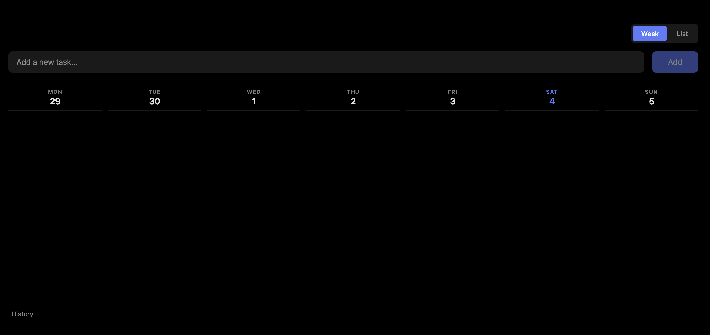

# My New Tab

  

Personal **new tab** extension (Chromium Browsers only).

## My New Tab

My New Tab is a personal new tab extension for managing your daily tasks. It is a simple extension that sits in your _new tab page_ and allows you to manage your daily tasks at a glance.

## Features

  

- Todo list / Weekly view
- History
- Task management

## Load an unpacked extension

- Clone the repo and install dependencies: `pnpm install`
- Build it: `pnpm run build` (outputs to `dist/`)
- From your extensions management UI, enable "Developer Mode"
- Click on "Load unpacked"
- Select the `dist/` folder

## Build a signed .crx

`pnpm run build:crx` builds the extension and packs it into a `my-new-tab.crx` file using your local Chrome/Chromium install (via `chrome --pack-extension`, no extra dependency).

- Requires Chrome or Chromium installed locally. If it isn't found automatically, point at it with `CHROME_PATH=/path/to/chrome pnpm run build:crx`.
- The first run generates a `my-new-tab.pem` signing key in the project root. **This key is gitignored and must never be committed** — it determines the extension's permanent ID. Back it up somewhere safe.
- To reuse an existing key on later builds (keeping the same extension ID), set `CRX_KEY_PATH=/path/to/my-new-tab.pem pnpm run build:crx`.
